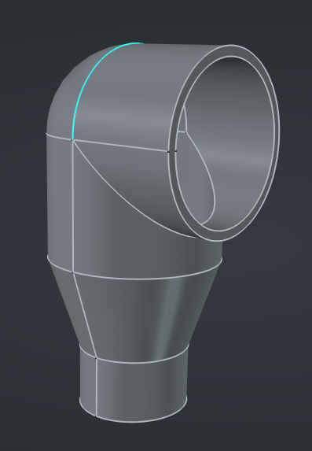
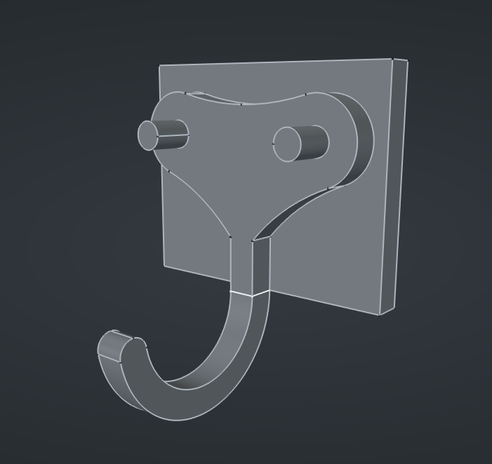
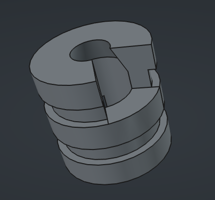
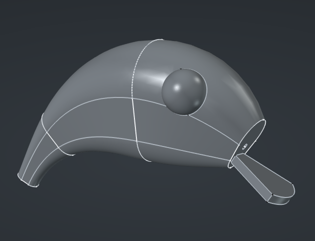
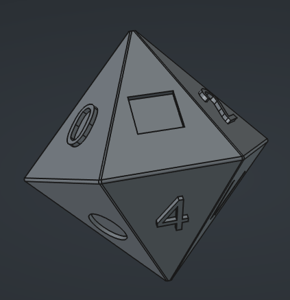
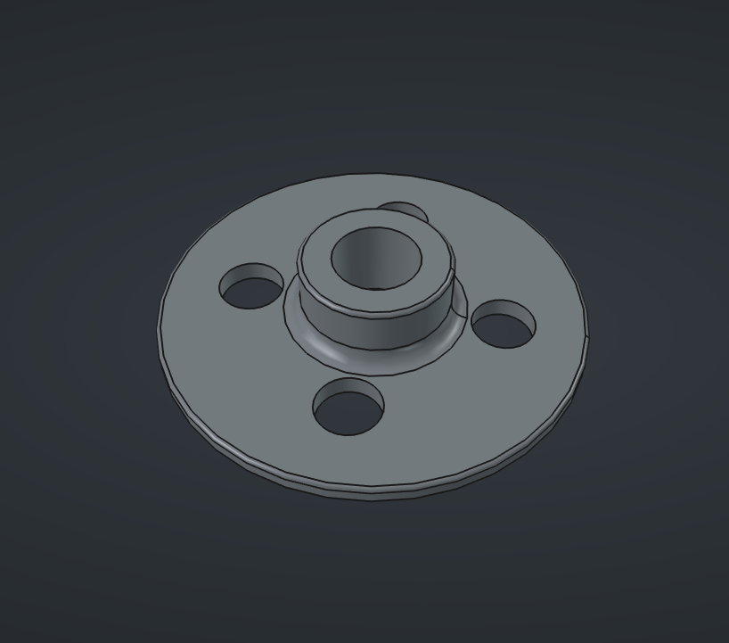
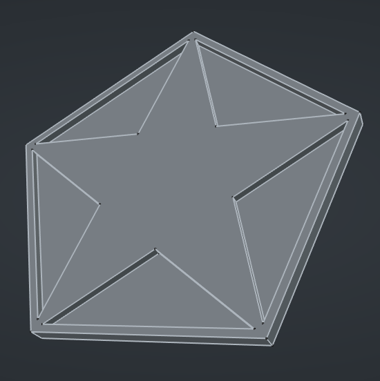
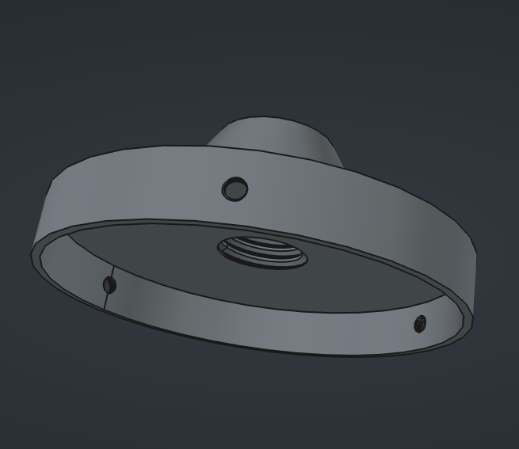
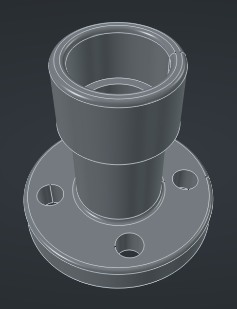
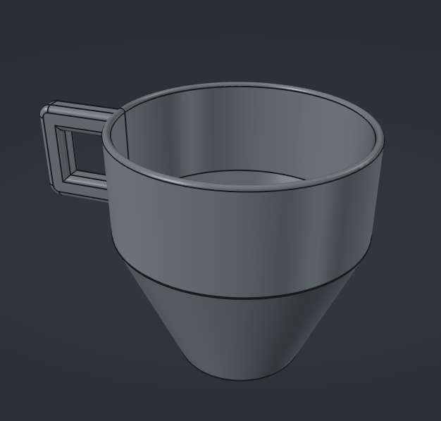

# FreeCAD in 30 Days
A public learning journal documenting my journey of learning FreeCAD from scratch.

This repository focuses on documenting my learning progress rather than presenting polished CAD projects.

## Progress
- Day 1: Basic navigation, Sketching, Extrusions
- Day 2: Revolve, Groove, External projections, Fillet, Additive pipe
- Day 3: Additive & Subtractive primitives, Pocket, Arc Slot, Transparency
- Day 4: Draft Workbench, Map Mode, Justification, Selection Filter
- Day 5: Attaching sketches to Non-Planar surfaces, Holes and Threaded holes, Datum Planes
- Day 6: Additive loft, Split edge, Carbon copy
- Day 7: Subtractive loft, Draft workbench's clone tool
- Day 8: Revised content from Days 1-7 and practiced by making a few models. 
- Day 9: Lofting to a point, Tapered lofts
- Day 10: Additive Pipe

## Gallery
<table>
  <tr>
    <td align="center">
       
      Vacuum Elbow Joint
    </td>
    <td align="center">
       
      Hook
    </td>
    <td align="center">
       
      Coupler
    </td>
  </tr>

  <tr>
    <td align="center">
       
      Fishing Lure
    </td>
    <td align="center">
       
      Multisided Die
    </td>
    <td align="center">
       
      Circular Locking Flange
    </td>
  </tr>

  <tr>
    <td align="center">
       
      Star Inside Pentagon
    </td>
    <td align="center">
       
      Light Housing
    </td>
    <td align="center">
       
      Pipe Connector
    </td>
  </tr>

  <tr>
    <td align="center">
       
      Mug
    </td>
    <td></td>
    <td></td>
  </tr>
</table>